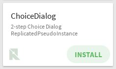
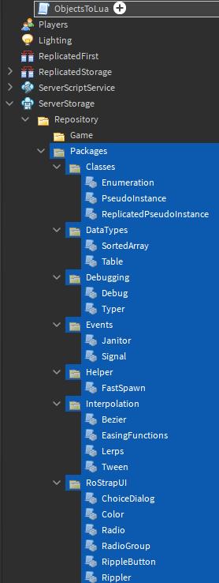
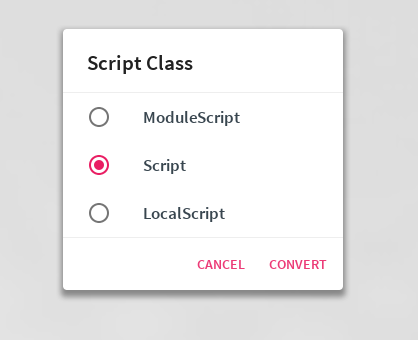

Let's say we want to Bundle ChoiceDialog with a plugin. Specifically, an "Object to Lua" plugin.



We're going to want all of our libraries under the same Object. In this case we are going to place our libraries under the main Script of the plugin.

 

Next, we are going to run a script that will replace the Resources functions with some simple replacements.

Enable your command bar (under the View tab) and paste the following script in. Make sure to change `PARENT_OF_LIBRARIES` to fit your use case.

```lua
local PARENT_OF_LIBRARIES = workspace.ObjectsToLua

local LocalTables = {}
for _, Object in next, PARENT_OF_LIBRARIES:GetDescendants() do
	if Object:IsA("LuaSourceContainer") then
		local Source = Object.Source

		Object.Source = Source
			:gsub("local Resources = [^\r\n]+[\r\n]", "\nlocal function LoadLibrary(Name)\n\treturn require(script.Parent[Name])\nend\n")
			:gsub("Resources:LoadLibrary(%b())", "LoadLibrary%1")
			:gsub("Resources:GetLocalTable(%b())", function(x)
				local Name = "LocalTable" .. x:sub(3, -3)

				if not LocalTables[Name] then
					LocalTables[Name] = true
					local Mod = Instance.new("ModuleScript", PARENT_OF_LIBRARIES)
					Mod.Source = "return {}\n"
					Mod.Name = Name
				end

				return "LoadLibrary(\"" .. Name .. "\")"
			end)
	end
end
```

This code should work for any of the libraries under the RoStrap organization, with the exception of the `Sentry` library.

Now we can write some code for the plugin:

```lua
require(script.ChoiceDialog) -- Preload the libraries
require(script.ReplicatedPseudoInstance)
local PseudoInstance = require(script.PseudoInstance)

local Dialog = PseudoInstance.new("ChoiceDialog")
Dialog.HeaderText = "Script Class"
Dialog.Options = {"ModuleScript", "Script", "LocalScript"}
Dialog.DismissText = "CANCEL"
Dialog.ConfirmText = "CONVERT"
Dialog.PrimaryColor3 = PrimaryColor3
Dialog.Parent = game

local _, Choice = Dialog.OnConfirmed:Wait()

print(Choice)
```



Add some glue, and you've got yourself a plugin running RoStrapUI! Publish your plugin and try it out. Also be sure to check out my RbxObject2Lua plugin by clicking the following image:

[](https://www.roblox.com/library/2307140444/Obj2Lua)
